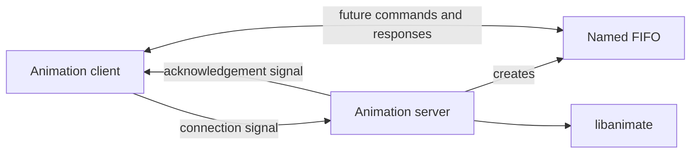

# C Sprite Animation Engine

A C11 sprite-animation project evolving from an in-process graphics engine into a signal-and-FIFO client–server system.

> **Version 2 status:** `0.2.0-alpha` — the animation engine is usable, while the client–server communication layer is still under development.


## Overview

Version 1 implements the core animation engine: canvases, reusable sprites, layer ordering, transparency, clipping, physics-based movement, and raw ARGB32 frame generation.

Version 2 begins separating the application into client and server processes. The server links against a supplied `libanimate` static library and currently verifies the canvas lifecycle. Signal handling, FIFO creation, acknowledgement, and command exchange are planned but are not implemented in the attached v2 source yet.

## Version 2 status

| Component | Status |
| --- | --- |
| Core canvas and sprite engine | Implemented |
| Basic and shapes examples | Implemented |
| Standalone client executable | Builds; communication logic pending |
| Server executable | Canvas smoke test implemented |
| External `libanimate` integration | Makefile target provided |
| Signal-based connection request | Planned |
| FIFO creation and cleanup | Planned |
| Server acknowledgement signal | Planned |
| Client/server command protocol | Planned |

## Intended architecture

The comments in the v2 files describe the following intended flow:



This diagram describes the planned architecture, not completed runtime behaviour.

## Existing engine features

- Configurable ARGB canvas creation.
- Rectangle and filled-circle sprites.
- Compatible 32-bit ARGB Bitmap V5 sprite loading.
- Reusable sprites with multiple placements.
- Doubly linked layer ordering.
- Velocity- and acceleration-based movement.
- Canvas-boundary clipping and transparent pixels.
- Sprite reference-count protection.
- Raw ARGB32 frame generation.

## Project structure

| Path | Purpose |
| --- | --- |
| `animate.c` | Version 1 animation-engine implementation. |
| `animate.h` | Version 1 public animation API. |
| `animate_client.c` | Version 2 client entry point; IPC logic is pending. |
| `animate_server.c` | Version 2 server entry point and `libanimate` smoke test. |
| `main_simple.c` | Basic rectangle example. |
| `check.c` | Extended rectangle-and-circle example. |
| `Makefile` | Engine, demo, client, and server build targets. |
| `docs/ARCHITECTURE.md` | Current and planned client–server design. |
| `assets/demo.png` | Enlarged preview generated by the shapes example. |
| `CHANGELOG.md` | Version history. |
| `CONTRIBUTING.md` | Contribution and testing guidance. |

## Requirements

For the engine examples and client:

- A C11-compatible compiler such as GCC or Clang
- `make`

For the supplied v2 server dependency:

- The provided `libanimate-aarch64.zip`
- 64-bit ARM Linux (`aarch64`)
- `unzip`

The supplied archive contains an **ELF AArch64** static library. It will not link on x86-64 Linux or macOS, including Apple Silicon macOS. A compatible build of `libanimate` is required on other platforms.

## Build the portable targets

Build the v1 examples and the v2 client:

```bash
make
```

Run the examples:

```bash
make run
make run-shapes
```

Each example writes a raw frame to `simple.dat`.

## Build the v2 server

The precompiled dependency is deliberately not committed to the repository. Extract the supplied archive in the project root so the following paths exist:

```text
libanimate/include/animate/animate.h
libanimate/lib/libanimate.a
libanimate/doc/PointerProAnimateRefman.pdf
```

Then, on compatible 64-bit ARM Linux:

```bash
make server
./animate_server
```

To use a compatible dependency stored elsewhere:

```bash
make server LIBANIMATE_DIR=/path/to/libanimate
```

## Useful Make targets

| Command | Result |
| --- | --- |
| `make` | Builds both engine examples and the v2 client. |
| `make engine` | Builds `animate.o`. |
| `make demos` | Builds `test_simple` and `check_demo`. |
| `make client` | Builds `animate_client`. |
| `make server` | Builds `animate_server` using external `libanimate`. |
| `make run` | Runs the basic engine example. |
| `make run-shapes` | Runs the extended shapes example. |
| `make clean` | Removes generated objects, executables, and frame data. |

## Engine output format

`animate_generate_frame` writes packed 32-bit `color_t` pixels in `0xAARRGGBB` form. The examples write this memory directly to `simple.dat`; it is raw pixel data rather than an encoded PNG or video.

## Current limitations

- The v2 client has no connection or command logic yet.
- The v2 server does not yet install signal handlers or create FIFOs.
- No client/server message format has been defined.
- The supplied server library is platform-specific.
- Encoded image/video output and partial alpha blending are not available.
- The custom animation callback in the local v1 engine remains a placeholder.

## Roadmap

1. Define the connection signals and client/server lifecycle.
2. Create a unique FIFO safely for each client.
3. Add acknowledgement, timeout, and interruption handling.
4. Define and validate a command protocol.
5. Add integration tests covering multiple clients and cleanup.
6. Add portable dependency builds or source-based linking.

More design notes are available in [docs/ARCHITECTURE.md](docs/ARCHITECTURE.md).

## Contributing

Bug reports and pull requests are welcome. Read [CONTRIBUTING.md](CONTRIBUTING.md) before submitting changes. Please distinguish implemented behaviour from planned behaviour in documentation and pull requests.

## License

No open-source license has been selected. Confirm that all collaborators and any provider of starter code or precompiled libraries permit public distribution before publishing the repository.
