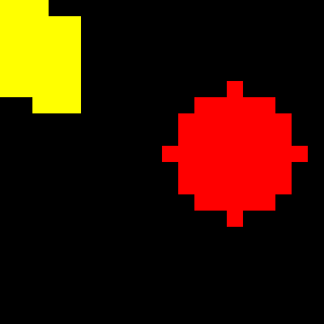

# C Sprite Animation Engine

A lightweight C library for creating, layering, and animating bitmap and geometric sprites on an ARGB canvas.



> The example frame is enlarged with nearest-neighbour scaling so the individual pixels remain visible.

## Overview

This project implements a small 2D animation engine in C. It supports canvases, reusable sprites, sprite placement and layer ordering, basic physics-based movement, transparency, clipping, and raw frame generation.

The project is also a practical demonstration of core C concepts such as dynamic memory management, opaque structures, file I/O, reference counting, doubly linked lists, pixel manipulation, and modular API design.

## Features

- Create a canvas with a configurable size and background colour.
- Create rectangle and circle sprites in code.
- Load 32-bit ARGB sprites from Bitmap V5 files.
- Place the same sprite on a canvas more than once.
- Move placements up, down, to the top, or to the bottom of the layer stack.
- Animate sprites with velocity and acceleration.
- Clip sprites that extend beyond the canvas boundaries.
- Treat pixels with an alpha value of zero as transparent.
- Prevent a sprite from being destroyed while it is still placed on a canvas.
- Generate each animation frame as a raw ARGB32 pixel buffer.

## How the animation works

For a requested frame, the engine calculates time as:

```text
t = frame_number / frame_rate
```

It then calculates the sprite position independently on each axis:

```text
position = initial_position + velocity * t + 0.5 * acceleration * t^2
```

Placements are rendered from the bottom layer to the top layer, so later layers overwrite earlier ones wherever their non-transparent pixels overlap.

## Project structure

| Path | Purpose |
| --- | --- |
| `animate.h` | Public types, helper functions, and animation API declarations. |
| `animate.c` | Canvas, sprite, placement, layering, animation, and frame-generation implementation. |
| `main_simple.c` | Minimal example that creates two overlapping rectangles. |
| `check.c` | Extended example using rectangles and a circle. |
| `Makefile` | Build, run, and cleanup commands. |
| `assets/demo.png` | Enlarged preview generated from the extended example. |
| `CHANGELOG.md` | Version history and planned changes. |
| `CONTRIBUTING.md` | Guidelines for proposing changes. |

Generated object files, executables, raw frames, and documentation output are excluded through `.gitignore`.

## Requirements

- A C11-compatible compiler such as Clang or GCC
- `make`

The project has no external runtime dependencies.

## Build and run

Clone the repository and enter its directory:

```bash
git clone https://github.com/YOUR_USERNAME/c-sprite-animation-engine.git
cd c-sprite-animation-engine
```

Build the basic example:

```bash
make
```

Run it:

```bash
make run
```

This creates `simple.dat`, a `10 x 10` raw ARGB32 frame containing `400` bytes.

To build and run the extended shapes example:

```bash
make check_demo
make run-shapes
```

The extended example replaces `simple.dat` with a `20 x 20` frame containing `1600` bytes.

Remove generated files with:

```bash
make clean
```

## Use the library in another C program

Include the public header, create a canvas and sprite, place the sprite, and ask the engine to generate a frame:

```c
#include "animate.h"
#include <stdlib.h>

int main(void) {
    struct canvas *canvas = animate_create_canvas(
        100,
        160,
        animate_color_argb(255, 20, 20, 20)
    );

    struct sprite *circle = animate_create_circle(
        8,
        animate_color_argb(255, 255, 80, 80),
        true
    );

    struct sprite_placement *placement =
        animate_place_sprite(canvas, circle, 10, 20);

    animate_set_animation_params(placement, 30, 0, 0, 10);

    size_t frame_size = animate_frame_size_bytes(canvas);
    void *frame = malloc(frame_size);
    animate_generate_frame(canvas, 30, 30, frame);

    free(frame);
    animate_destroy_canvas(canvas);
    animate_destroy_sprite(circle);
    return 0;
}
```

Compile your program together with the library implementation:

```bash
cc -std=c11 your_program.c animate.c -o your_program
```

## Main API

| Function group | Important functions |
| --- | --- |
| Canvas lifecycle | `animate_create_canvas`, `animate_destroy_canvas` |
| Sprite lifecycle | `animate_create_sprite`, `animate_create_rectangle`, `animate_create_circle`, `animate_destroy_sprite` |
| Placement lifecycle | `animate_place_sprite`, `animate_destroy_placement` |
| Layer ordering | `animate_placement_up`, `animate_placement_down`, `animate_placement_top`, `animate_placement_bottom` |
| Motion | `animate_set_animation_params` |
| Frame output | `animate_frame_size_bytes`, `animate_generate_frame` |
| Colour helpers | `animate_color_rgb`, `animate_color_argb` |

See the documentation comments in `animate.h` for parameter and ownership details.

## Output format

`animate_generate_frame` writes one packed `color_t` value per pixel to a caller-provided buffer. A `color_t` is a 32-bit unsigned integer in `0xAARRGGBB` form.

The example programs write this memory directly to `simple.dat`. This is raw pixel data rather than a PNG, JPEG, or video file, so a viewer must be given the frame width, height, and ARGB32 layout.

## Current limitations

- Frame export is raw ARGB32 data; encoded image and video output are not included yet.
- The custom animation callback function is declared but is currently a placeholder.
- Circle sprites currently support the filled form only.
- Bitmap loading expects a compatible 32-bit ARGB Bitmap V5 file and performs limited format validation.
- The engine replaces pixels based on transparency; partial alpha blending is not implemented.

## Roadmap

- Implement custom animation callbacks.
- Add stricter validation and error handling for bitmap input.
- Add PNG or video export helpers.
- Add automated unit tests and memory-safety checks.
- Add alpha blending and more primitive shapes.

## Contributing

Suggestions, bug reports, and pull requests are welcome. Read [CONTRIBUTING.md](CONTRIBUTING.md) before submitting a change.

## Version

This repository contains version `0.1.0`, the first public project version. See [CHANGELOG.md](CHANGELOG.md) for details.

## License

No open-source license has been selected for version `0.1.0`. Please contact the repository owner before copying, modifying, or redistributing the code.
